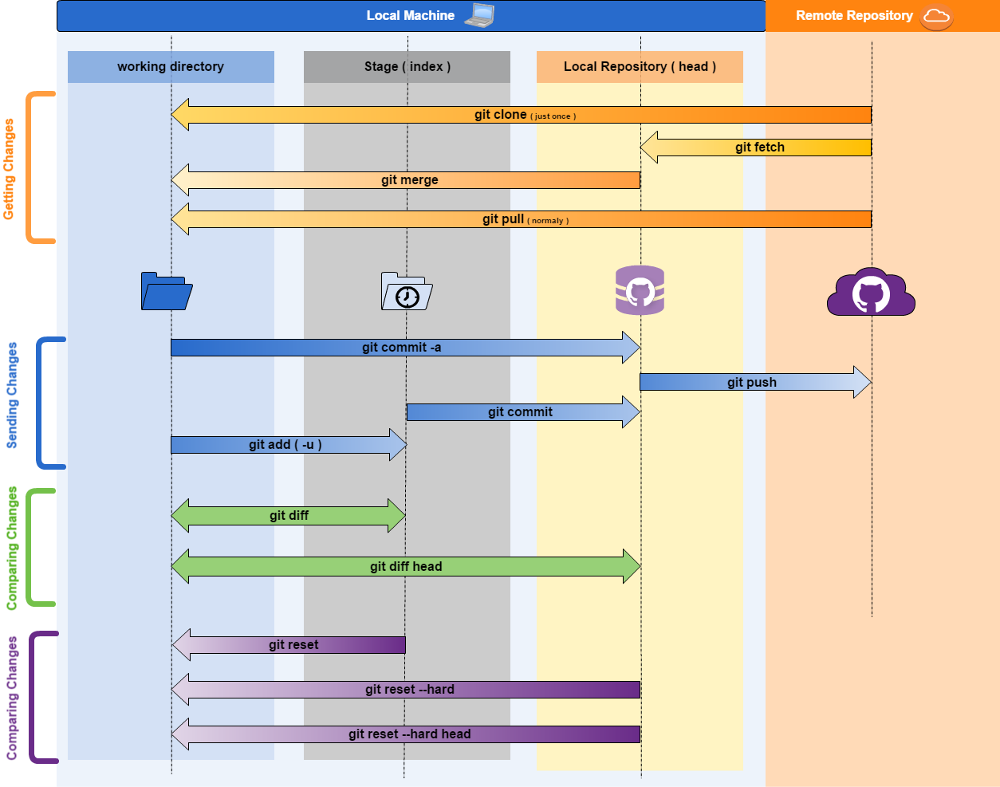

Git Basics
==========
index
-----
- [Git command](#git-command)
    - [Git clone](#)
    - [Git fetch](#)
    - [Git merge](#)
    - [Git pull](#)
    - [Git commit -a](#)
    - [Git add (-u)](#)
    - [Git push](#)
    - [Git diff](#)
    - [Git diff head](#)
- Git stash
- Git WorkFlow

-----

### Git command
#### Small intro:
  To start, you should know that in any time  on ___Git___, you can have four diffrent '_vesions_' or '_states_' of any element (file or directory).  
  Example:

  
#### git clone :
  This command is used only once at startup to download the project,
  and whenever it is runned the path or url of the remote repository of the project must be passed.  
  Example:
  ```bash
  git clone http://baseProyectOwner.com/url/path/proyecyGroup/_git/MyProyect
  ```
#### git fetch :
  Con `git fetch` descargamos todos los cambios que se hayen en nuestro repositorio remoto a nuestro repositorio local, lo cual representa un paso intermedio, evitando asi traer cambios directamente a nuestro directorio de trabajo, y ahorrando asi posibles conflictos de fusion.
  Entendiendo esto, una forma de ejecutar esto seria primero correr el comando _fetch_, y _diff head_.  
  Example:
  ```bash
    git fetch

    git diff head
  ```
#### git merge :
  Merges one or more branches into your current branch and automatically creates a new commit if there are no conflicts.  
  Example:
  ```bash
    git merge newbranchversion
  ```
#### git pull :
  Fetches the files from the remote repository and merges it with your local one. This command is equal to do _git fetch_ and _git merge_ sequence.  
  Example:
  ```bash
    git pull origin develop
  ```
#### git add (-u) :
  Adds files changes in your working directory to your index.
  you can add a single file, a folder or all.  
  Example:
  ```bash
  git add rootPath/fileFolder/subfolder/index.js
  
  git add rootPath/fileFolder/subfolder/*.js

  git add rootPath/fileFolder/*

  git add .
  ```
#### git commit (-a) :
  Takes all of the changes written in the index, creates a new commit object pointing to it and sets the branch to point to that new commit. Examples: git commit -m ‘committing added changes’.  
  Example:
  ```bash
    git commit -a -m "committing all changes, equals to git add and git commit"
  ```
#### git push :
  Pushes all the modified local objects commited in your local repository to the remote repository and advances its branches.  
  Example:
  ```bash
  git push origin currentWorkingBranch
  ```
#### git diff :
  In general compare your lost file changes in your working directory, with the last changes added to stage
  Generates patch files or statistics of differences between paths or files in your git repository, or your index or your working directory. 
  you can run `git diff` beetwen files, branches, or commits.  
  Example:
  ```bash
  git diff

  git diff feature/brancheId-1 feature/brancheId-1
  
  git diff 34ffd1a93c0883bda022ac070d959cfbff3f7ff9
  
  ```
#### git diff head :
  _git diff head_ is an special kind of __diff__ that compare your lost file changes in your working directory, directly with your lost changes commited in your local repository.  
  Example:
  ```bash
    git diff head
  ```
#### git reset :
  _git reset_ remove your lost changes added to stage, but kipping your changes. _git reset --hard_ reset your index and working directory to the state of your last commit. _git reset --hard HEAD_ reset your index and working directory to the state of your last commit
  Example:
  ```bash
    git reset

    git reset --hard 
    
    git reset --hard head
  ```



----


----


----


